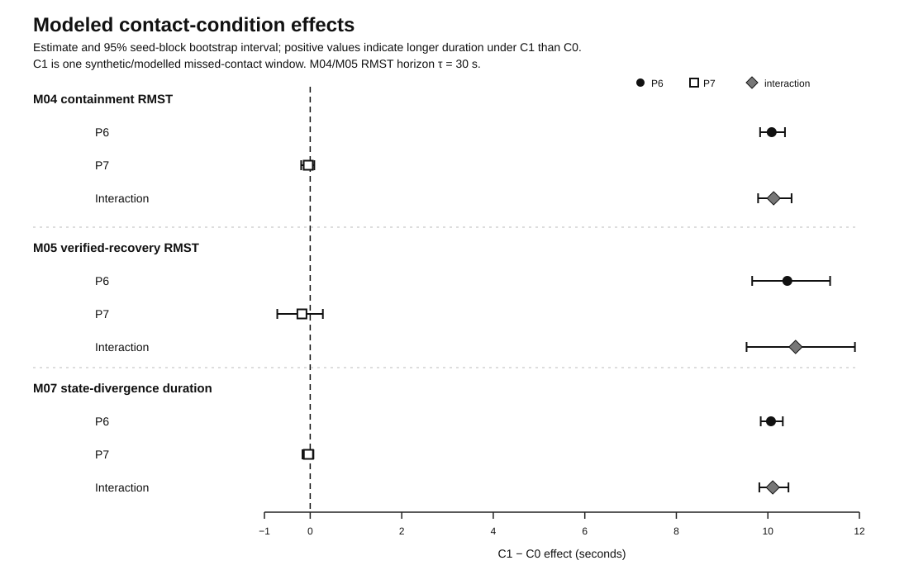
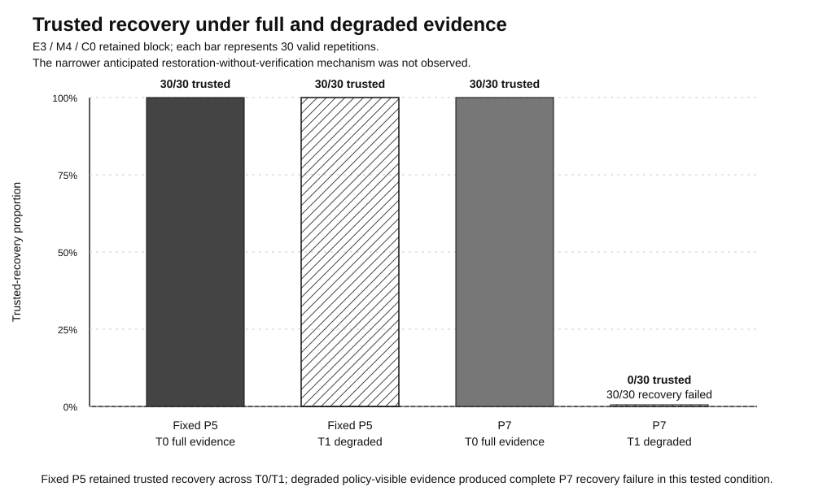
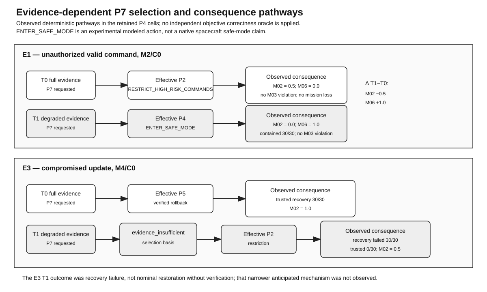
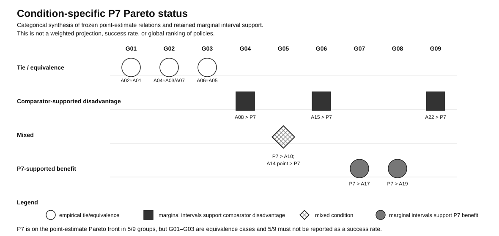

<div align="center">

# Mission-Aware Satellite Cyber Response and Trusted Recovery

**A reproducible software-in-the-loop study of cyber response and trusted recovery under spacecraft mission-state, contact, and evidence constraints.**

[](https://doi.org/10.5281/zenodo.22181540)
[](https://orcid.org/0009-0008-9752-3743)
[](LICENSE)
[](LICENSE)

[Dataset](https://doi.org/10.5281/zenodo.22181540) · [Manuscript](publication/README.md) · [Figures](publication/figures/) · [Reproduce](docs/REPRODUCIBILITY_GUIDE.md) · [Final academic audit](docs/48-final-academic-and-bibliography-sanity-audit.md) · [Security](SECURITY.md) · [Citation](CITATION.cff)

</div>


## Research at a glance

| Item | Frozen / published state |
|---|---|
| Testbed | Researcher-controlled NOS3 + Fortytwo + cFS software-in-the-loop environment |
| Experimental design | 24 frozen cells × 30 valid repetitions |
| Statistical population | **720 VALID observations** |
| Retained provenance | 9 ledgered INVALID attempts; 1 additional quarantined never-ledgered interruption |
| Conditions | Synthetic cyber events, mission states, telemetry/evidence conditions, and modeled contact behavior |
| Raw campaign archive | Zenodo **v1.0.0**, DOI [`10.5281/zenodo.22181540`](https://doi.org/10.5281/zenodo.22181540) |
| Concept DOI | [`10.5281/zenodo.22181539`](https://doi.org/10.5281/zenodo.22181539) |
| Research status | WP0–WP11 scientific work, analysis, integrity freeze, responsible release, cybersecurity framing, and author attestations are complete; the package is at the **final submission-export gate** for Computers & Security |

The study asks how alternative cyber-response strategies affect containment, verified trusted recovery, safety, and mission continuity when the same synthetic cyber event occurs under different spacecraft states, telemetry/evidence conditions, and modeled ground-contact conditions.

The simulator is infrastructure rather than the principal contribution. The contribution is a reproducible comparative method, evidence-aware trusted-recovery model, integrity-frozen outcome record, and bounded analysis of security-versus-mission trade-offs. The results do **not** establish universal superiority of a mission-aware policy.

## Published research record

The exact public research-data/reproducibility package is archived separately from GitHub so that the evidence-of-record is stable and citable:

> **Singh, A. (2026). _Mission-Aware Satellite Cyber Response and Trusted Recovery Under Contact and Evidence Constraints — Research Data and Reproducibility Artifacts_ (Version 1.0.0) [Dataset]. Zenodo.**  
> <https://doi.org/10.5281/zenodo.22181540>

The Zenodo deposit contains the frozen raw campaign archive, integrity-freeze archive, publication/provenance archive, release README, manifest, and SHA-256 checksum file. The version-specific DOI above should be used when reproducibility depends on the exact v1.0.0 files.

## Results graphics

The publication-ready figures are tracked as SVG so they remain crisp in GitHub, manuscripts, and exported documents.

<table>
  <tr>
    <td width="50%"></td>
    <td width="50%"></td>
  </tr>
  <tr>
    <td align="center"><strong>R1 — Modeled contact effects</strong></td>
    <td align="center"><strong>R2 — Trusted recovery</strong></td>
  </tr>
  <tr>
    <td width="50%"></td>
    <td width="50%"></td>
  </tr>
  <tr>
    <td align="center"><strong>R3 — Evidence-driven selection pathway</strong></td>
    <td align="center"><strong>R4 — Condition-specific Pareto status</strong></td>
  </tr>
</table>

Read the figures with the corresponding statistical and claim-boundary text in [`publication/manuscript/04-results.md`](publication/manuscript/04-results.md) and [`publication/manuscript/05-discussion.md`](publication/manuscript/05-discussion.md).

## Repository map — recommended reading order

The historical research files keep their stable names and paths so citations, hashes, and provenance references are not broken. For human readers, use this order:

| Order | Location | Purpose |
|---:|---|---|
| 1 | [`publication/`](publication/README.md) | Manuscript, figures, tables, citation/claim controls |
| 2 | [`analysis/`](analysis/README.md) | Executable reconstruction of the frozen WP10 statistical analysis prepared after campaign/Zenodo publication and before journal submission; validated against preserved reference outputs |
| 3 | [`docs/`](docs/) | Theory, methods, legal/ethical boundaries, work-package evidence, integrity/release closeouts |
| 4 | [`configs/`](configs/) | Frozen experiment designs, schemas, adapters, toolchain locks |
| 5 | [`src/mission_recovery/`](src/mission_recovery/) | Research implementation and policy/runtime logic |
| 6 | [`tests/`](tests/) | Unit, contract, regression, and campaign-governance tests |
| 7 | [`scripts/`](scripts/) | Validation, testbed, runtime, campaign, and release tooling |
| 8 | [`artifacts/`](artifacts/) | Reproducibility lock records retained in Git |
| 9 | [`tracker/`](tracker/) | Work-package state, decisions, risks, and campaign closeout tracking |
| 10 | [`release/`](release/) | Responsible-release controls and Zenodo publication record |
| 11 | [Zenodo v1.0.0](https://doi.org/10.5281/zenodo.22181540) | Raw WP9 campaign evidence and exact DOI-bearing reproducibility package |

Raw `results/wp9/campaign/` evidence is intentionally not stored in GitHub. The DOI-bearing Zenodo record is the public archive for that evidence.

## Quick start: validate the repository locally

The fastest validation path does **not** start NOS3, Docker containers, a scientific campaign, or any event-injection runtime.

```bash
git clone https://github.com/Zartharas/mission-aware-satellite-cyber-recovery.git
cd mission-aware-satellite-cyber-recovery

python3 -m venv .venv
source .venv/bin/activate
python -m pip install --upgrade pip
python -m pip install -r requirements-dev.txt

python scripts/audit_repository_release_gate.py
python scripts/audit_bibliography_metadata.py
python scripts/validate_experiment_schema.py
python -m unittest discover -s tests -p 'test_*.py'
```

Windows users should use WSL for the Bash-based tooling; the pure Python validation/tests can also be run from a normal Python environment after activating the virtual environment.

For the pinned Docker/NOS3/Fortytwo setup, expected PASS markers, cleanup, Apple Silicon notes, and the distinction between repository validation and a new scientific replication, see **[`docs/REPRODUCIBILITY_GUIDE.md`](docs/REPRODUCIBILITY_GUIDE.md)**.

### Reproduce the frozen WP10 statistical contracts

The repository includes a statistical reconstruction under [`analysis/`](analysis/README.md) that was prepared after the campaign and Zenodo v1.0.0 publication but before journal submission. It is not the original WP10 analysis source; it starts from the frozen derived analysis inputs and regression-validates the reported statistical contracts against preserved authoritative outputs. It does not start the simulator or create campaign evidence.

```bash
python3.11 -m venv .venv-analysis
source .venv-analysis/bin/activate
python -m pip install --upgrade pip
python -m pip install --only-binary=:all: -r analysis/requirements.txt
python analysis/reproduce_wp10.py --validate
python -m unittest discover -s analysis/tests -p 'test_*.py'
```

## Reproducibility levels

1. **Repository validation — recommended first.** Current-state release-gate audit, bibliography metadata integrity checks, schema validation, exhaustive script syntax checks, Python compilation, and tests; no simulator runtime.
2. **Testbed preflight.** Rebuild the pinned NOS3/Fortytwo environment and run the bounded nominal runtime preflight under Docker isolation.
3. **Scientific replication.** Any new execution of experimental cells is a new replication, not the historical WP9 dataset. Do not overwrite or represent a new run as the archived v1.0.0 campaign.

The published archive can be checked independently with the included `RELEASE_CHECKSUMS.sha256` after downloading all six Zenodo files into one directory.

## Safety and scope

This repository is for controlled defensive research. The reported study:

- used researcher-controlled software simulation only;
- did not access operational spacecraft or ground stations;
- did not use operational or stolen credentials;
- did not transmit, jam, spoof, or interfere with RF;
- did not use classified or proprietary mission telemetry;
- does not demonstrate flight certification or production autonomous recovery.

See [`SECURITY.md`](SECURITY.md), [`docs/05-legal-ethical-boundaries.md`](docs/05-legal-ethical-boundaries.md), and [`docs/13-laboratory-rules-of-engagement.md`](docs/13-laboratory-rules-of-engagement.md).

## Citation

GitHub can expose citation metadata from [`CITATION.cff`](CITATION.cff). For the scientific evidence supporting this study, cite the **version-specific Zenodo DOI**:

```text
Singh, A. (2026). Mission-Aware Satellite Cyber Response and Trusted Recovery
Under Contact and Evidence Constraints — Research Data and Reproducibility
Artifacts (Version 1.0.0) [Dataset]. Zenodo.
https://doi.org/10.5281/zenodo.22181540
```

## Author

**Aman Singh** — Independent Researcher  
ORCID: <https://orcid.org/0009-0008-9752-3743>

This work was conducted independently and received no external funding.

## Licensing

This repository uses a split-license model; see [`LICENSE`](LICENSE) for the exact scope.

- Original software/code and software-like configuration contributed by the repository author: **MIT License**.
- Original research documentation, manuscript text, author-created tables/figures, and author-generated research data distributed from this project: **CC BY 4.0**, unless a file states otherwise.
- Zenodo dataset v1.0.0: **CC BY 4.0**.
- Third-party projects, source code, images, trademarks, citations, and other external material remain under their own terms and are not relicensed by this repository.

See [`NOTICE.md`](NOTICE.md) for the main third-party research infrastructure references.

## Contributing and responsible disclosure

Contributions that improve reproducibility, documentation, validation, and defensive research quality are welcome. Read [`CONTRIBUTING.md`](CONTRIBUTING.md) before opening a pull request.

Do not place credentials, proprietary telemetry, operational satellite details, or sensitive vulnerability information in a public issue. Follow [`SECURITY.md`](SECURITY.md) for responsible disclosure.
