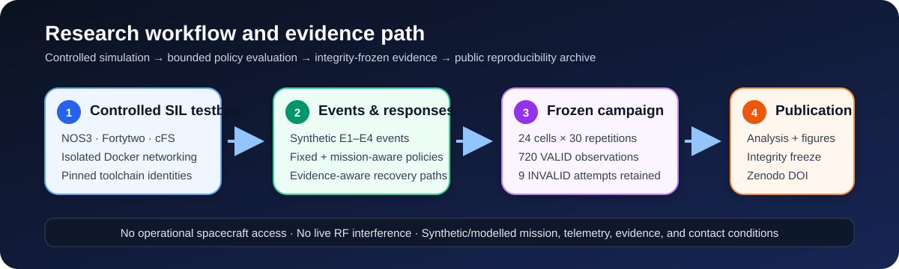

<div align="center">

# Mission-Aware Satellite Cyber Response and Trusted Recovery

**Reproducible software-in-the-loop journal research on cyber response and trusted recovery under mission, contact, evidence, and bounded-compromise constraints.**

[](https://doi.org/10.5281/zenodo.22181540)
[](https://orcid.org/0009-0008-9752-3743)
[](LICENSE)
[](LICENSE)

[Study 1 dataset](https://doi.org/10.5281/zenodo.22181540) · [Manuscript](publication/README.md) · [Study 2](study2/README.md) · [Reproduce](docs/REPRODUCIBILITY_GUIDE.md) · [Security](SECURITY.md) · [Citation](CITATION.cff)

</div>



## Research at a glance

This repository now contains **two separately frozen empirical studies** supporting a journal article. Their observations are never pooled into one statistical population.

| Item | Study 1 | Study 2 |
|---|---|---|
| Research role | Baseline comparative response/recovery study | Adversarial evidence-aware generalization study |
| Frozen design | 24 cells × 30 valid repetitions | 85 prespecified cells |
| Statistical population | **720 VALID observations** | **3,872 VALID observations** |
| Invalid-attempt handling | 9 retained INVALID attempts; one additional quarantined never-ledgered interruption | **0 INVALID attempts** |
| Main factors | cyber event, mission state, evidence condition, modeled contact | evidence mechanisms, adversary budget, contact regime, ambiguity controls, context ablations |
| Time basis | frozen 30-s Study-1 analysis horizon where applicable | deterministic logical SIL time; 240-logical-second RMST restriction |
| Public/source evidence | Zenodo v1.0.0, DOI `10.5281/zenodo.22181540` | Phase-6 evidence is hash-bound; responsible-release-reviewed DOI archive is a pre-submission gate |
| Statistical results | frozen WP10 record and reconstructed regression-tested reproduction package | canonical Phase-7 freeze with independent reproduction, **0 mismatches** |

**Current repository state:** Study-1 science is frozen. Study-2 Phase 7 is `PRESPECIFIED_ANALYSIS_RESULTS_FROZEN_CANONICAL`. The active work is **journal-manuscript integration, claim-to-evidence reconciliation, Study-2 source-evidence responsible release, and final submission preparation**. No new campaign execution is authorized by this current-state documentation.

Study-2 canonical result/provenance records:

- [`study2/docs/PHASE7_RESULTS_FREEZE.md`](study2/docs/PHASE7_RESULTS_FREEZE.md)
- [`study2/PHASE7_RESULTS_FREEZE.json`](study2/PHASE7_RESULTS_FREEZE.json)
- [`study2/PHASE7_PROVENANCE.json`](study2/PHASE7_PROVENANCE.json)
- [`study2/evidence/phase7/`](study2/evidence/phase7/)

The Study-2 analysis covers 162 primary paired contrasts and 432 prespecified secondary contrasts. The exact Phase-7 results ZIP is durably retained in repository history at `study2/evidence/phase7/archive/`. The underlying 3,872-observation Phase-6 evidence remains a separately governed source artifact; it must receive responsible-release review and a durable DOI-bearing archive before journal submission.

## Scientific interpretation boundaries

The journal work intentionally preserves negative and conditional findings rather than promoting a universal policy winner.

- Study 1 remains exactly 720 VALID observations; the 696-observation final-commit analysis remains sensitivity only.
- Study 2 remains exactly 3,872 VALID observations across 85 cells; it is not appended to or pooled with Study 1.
- Study-2 Block-C BENIGN/ADVERSARIAL contrasts are a **structural label-invariance control**, not empirical evidence about discrimination between genuinely different benign and adversarial causes.
- K4 is a separate intermittent/flapping-contact profile, not ordinal severity 4.
- A2/K2 is a coupled producer-compromise/contact-loss profile, not an unconfounded adversary-only effect.
- Logical SIL seconds are model time, not spacecraft, network, ground-station, or operator wall-clock latency.
- No weighted global policy score or global policy rank is supported.
- The evaluated selectors are deterministic rule-based mechanisms, not AI/ML scientific methods.
- The work makes no operational spacecraft, real-RF, flightworthiness, or certification claim.

## Evidence and archive status

### Study 1

The exact public Study-1 research-data/reproducibility package is archived on Zenodo:

> **Singh, A. (2026). _Mission-Aware Satellite Cyber Response and Trusted Recovery Under Contact and Evidence Constraints — Research Data and Reproducibility Artifacts_ (Version 1.0.0) [Dataset]. Zenodo.**  
> <https://doi.org/10.5281/zenodo.22181540>

Version DOI: `10.5281/zenodo.22181540`  
Concept DOI: `10.5281/zenodo.22181539`

This DOI-bearing release is the **Study-1 evidence-of-record**. It must not be described as containing Study-2 source observations.

### Study 2

The Study-2 source campaign is identified by immutable hashes, including:

- Phase-6 artifact ZIP SHA-256: `195860bd44b38ccf170f02cb1cb392583217296d08640c99b18b52286403e133`
- observations SHA-256: `8dcc850c561d7e3c0bf7478263b534cae83cbbb55183c313e879dd7d61127854`
- attempt-ledger SHA-256: `755d6541263ac31589934200ea5071cdbcacae1ea197d044bbd3e6f7f7d1dbc5`
- trial-manifest SHA-256: `190612473717b7768ceccb4596a20d90cd7d532bf7581330ce94d609cb752e67`
- Phase-7 result ZIP SHA-256: `0136123a53d150437fefc8ace342af63b11d980cf8cab32ef7a4f03b78267417`

A DOI for the Study-2 source-evidence package is **not yet claimed here**. Publishing that archive requires the separate responsible-release gate recorded in the journal manuscript.

## Publication package

Use [`publication/README.md`](publication/README.md) as the current article index. The authoritative journal source is componentized so the two frozen studies remain distinguishable:

- Study-1 Methods: `publication/manuscript/03-methods.md`
- Study-2 Methods extension: `publication/manuscript/03-study2-methods-extension.md`
- Study-1 Results: `publication/manuscript/04-results.md`
- Study-2 Results extension: `publication/manuscript/04-study2-results-extension.md`
- Cross-study Discussion: `publication/manuscript/05-discussion.md`
- Combined bounded Conclusion: `publication/manuscript/06-conclusion.md`

Historical Study-1 figures and tables remain frozen publication artifacts. Study-2 publication tables and claim traceability are maintained separately so later editing cannot silently rewrite Study-1 evidence.

## Repository map — recommended reading order

| Order | Location | Purpose |
|---:|---|---|
| 1 | [`publication/`](publication/README.md) | Current journal manuscript, displays, submission controls, and claim traceability |
| 2 | [`study2/`](study2/README.md) | Study-2 protocol, campaign, Phase-7 freeze, provenance, and independent audit |
| 3 | [`analysis/`](analysis/README.md) | Study-1 WP10 statistical reconstruction validated against preserved reference outputs |
| 4 | [`docs/`](docs/) | Theory, methods, legal/ethical boundaries, historical work-package evidence, and release closeouts |
| 5 | [`configs/`](configs/) | Frozen Study-1 experiment designs, schemas, adapters, and toolchain locks |
| 6 | [`src/mission_recovery/`](src/mission_recovery/) | Study-1 research implementation and policy/runtime logic |
| 7 | [`tests/`](tests/) | Unit, contract, regression, and campaign-governance tests |
| 8 | [`scripts/`](scripts/) | Validation, testbed, runtime, campaign, and release tooling |
| 9 | [`tracker/`](tracker/) | Current research state plus historical work-package decisions |
| 10 | [`release/`](release/) | Study-1 responsible-release controls and Zenodo publication record |

Historical files intentionally retain stage-local wording when that wording is part of provenance. Current state is governed by this README, `tracker/RESEARCH_TRACKER.md`, `study2/PHASE7_PROVENANCE.json`, and `publication/manuscript/MANUSCRIPT-ASSEMBLY.md`.

## Quick start: safe repository validation

The default validation path does **not** start NOS3, Docker campaign runtime, or event injection:

```bash
git clone https://github.com/Zartharas/mission-aware-satellite-cyber-recovery.git
cd mission-aware-satellite-cyber-recovery

python3 -m venv .venv
source .venv/bin/activate
python -m pip install --upgrade pip
python -m pip install -r requirements-dev.txt

python scripts/audit_repository_release_gate.py
python scripts/audit_bibliography_metadata.py
python scripts/validate_experiment_schema.py
python -m unittest discover -s tests -p 'test_*.py'
```

For the Study-1 statistical reproduction and the current Study-2 reproducibility boundary, see [`docs/REPRODUCIBILITY_GUIDE.md`](docs/REPRODUCIBILITY_GUIDE.md).

## Safety and scope

This repository is for controlled defensive research. The reported work:

- used researcher-controlled software simulation;
- did not access operational spacecraft or ground stations;
- did not use operational or stolen credentials;
- did not transmit, jam, spoof, or interfere with RF;
- did not use classified or proprietary mission telemetry;
- does not demonstrate flight certification or production autonomous recovery.

See [`SECURITY.md`](SECURITY.md), [`docs/05-legal-ethical-boundaries.md`](docs/05-legal-ethical-boundaries.md), and [`docs/13-laboratory-rules-of-engagement.md`](docs/13-laboratory-rules-of-engagement.md).

## Citation

`CITATION.cff` and Zenodo v1.0.0 currently identify the published **Study-1** evidence release. A future Study-2 DOI must be added only after the responsible-release package is actually published; no DOI is invented in advance.

## Author

**Aman Singh** — Independent Researcher  
ORCID: <https://orcid.org/0009-0008-9752-3743>

This work was conducted independently and received no external funding.

## Licensing

This repository uses a split-license model; see [`LICENSE`](LICENSE) for the exact scope. Original code is MIT-licensed; original research documentation/data distributed by this project is CC BY 4.0 unless a file states otherwise. Third-party material remains under its own terms.

## Contributing and responsible disclosure

Contributions that improve reproducibility, documentation, validation, and defensive research quality are welcome. Read [`CONTRIBUTING.md`](CONTRIBUTING.md) before opening a pull request. Do not place credentials, proprietary telemetry, operational satellite details, or sensitive vulnerability information in a public issue. Follow [`SECURITY.md`](SECURITY.md) for responsible disclosure.
