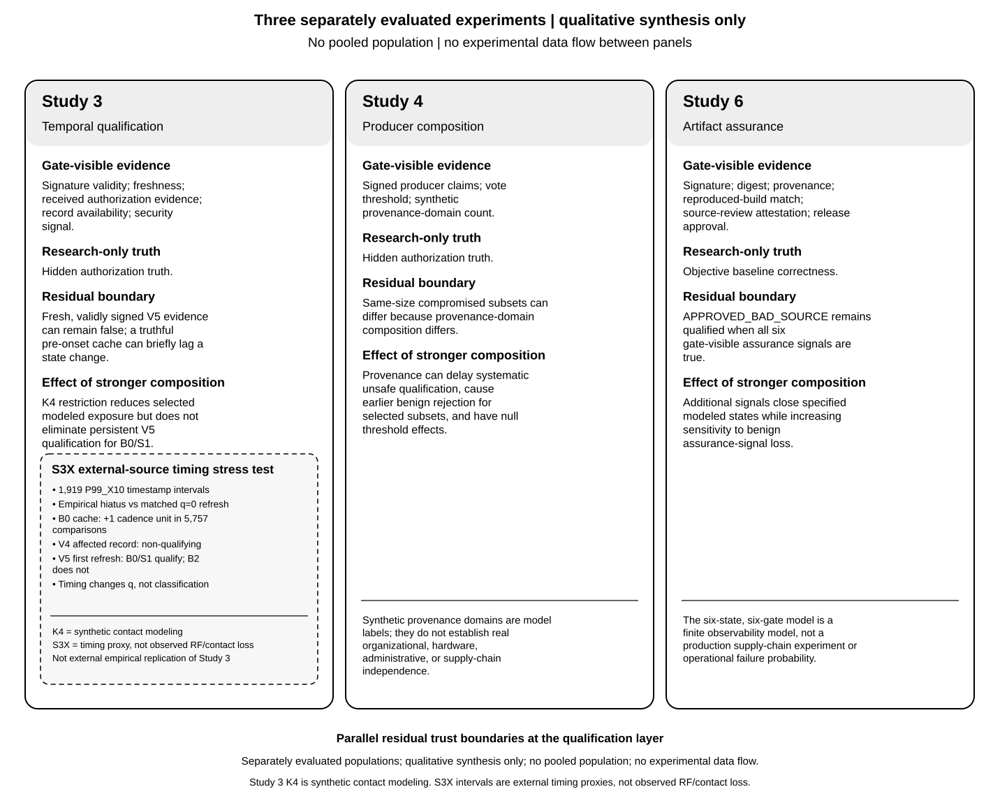

# Residual Trust Boundaries in Satellite Cyber-Recovery Qualification: Temporal Evidence, Producer Composition, and Artifact Assurance

> **CEAS Space Journal — R1 scientific-preserving author-review adaptation (NOT a submitted manuscript).**
>
> Source authority: Paper-2 venue-neutral R4, git blob `069e319864b1f5c1ee201b31872e68572fea1923`, main `4cd0c30a276b3c5a0494736b93a8d08dc1ed8df4`. Studies 3, 4, and 6 remain independently frozen; S3X and S6X are separately governed stress tests. Original R4, Figure 1 SVG, result freezes, and historical rejected publisher submissions are unchanged.
>
> Article type proposed: Original Research Article. Publication route planned: traditional subscription (no APC); neither article type nor publication choice has been submitted to the publisher.

**Aman Singh** — sole author  
Independent Researcher, The Woodlands, Texas, United States  
**Correspondence:** [ACTIVE EMAIL TO BE CONFIRMED AND INSERTED IN PRIVATE SUBMISSION EXPORT]  
**ORCID:** [VERIFY AGAINST AUTHOR PROFILE BEFORE FINAL PUBLISHER EXPORT]

## Abstract

Satellite cyber-recovery qualification depends on the evidence visible when a recovery step is authorized, rather than on hidden system truth. We examine which trust failures remain invisible under three separately frozen finite models of temporal evidence, producer composition, and recovery-artifact assurance. Study 3 (1,380 trajectories) distinguishes bounded reliance on truthful but stale authorization records from a false authorization claim validly signed by a compromised trusted producer. In a separately governed stress test, S3X uses 1,919 extreme European Space Agency telemetry inter-sample intervals solely as evidence-refresh-hiatus proxies; timing shifts when the false claim reaches the decision without correcting its first-refresh classification. Study 4 (4,608 observations across 18 vote/provenance rules) shows that producer diversity changes first and systematic unsafe-qualification boundaries, sometimes at the cost of benign-evidence availability. Study 6 (420 observations) reduces the modeled incorrect artifact states still qualified from four of five under signature-only checking to one of five under a six-signal gate. In separate executable stress test S6X, two repetitions of 396 observations using pinned NASA core Flight System/Limit Checker source distinguish clean and controlled bad-source artifacts in a research functional harness, while all six gate-visible signals remain satisfied. The engineering result is a mechanism-specific map of the property each qualification gate can and cannot establish. These models do not demonstrate operational spacecraft recovery, pooled effects, or external empirical replication.

**Keywords:** Aerospace cybersecurity, cyber-recovery qualification, evidence qualification, trust management, telemetry timing, software supply-chain assurance.

## 1 Introduction

A satellite cyber-recovery qualification mechanism does not act on hidden truth. It acts on evidence: signed records, measured state, producer agreement, provenance, build assurance, approval, and whatever timing context is available when the decision must be made. In a spacecraft setting, that distinction matters because communication can be intermittent, physical access is unavailable after launch, subsystems are tightly coupled, and mission continuity can constrain when evidence can be refreshed or checked [1]. NIST frames commercial satellite cybersecurity as a mission risk-management problem spanning space and supporting operational environments [18], while NASA's Space Security Best Practices Guide organizes mission-security controls around prevention, mitigation, and recovery [20]. Contemporary surveys likewise show a broad satellite-security landscape spanning space, ground, communication-link, and network layers [16], [17]. The narrower problem here is whether the evidence visible to a recovery-qualification decision is sufficient to distinguish a modeled safe state from an unsafe one.

For space-system engineering, this is a recovery-qualification requirements question rather than a test of an operational recovery sequence. A satellite recovery gate must specify what a signed authorization record, a multi-producer decision, or an approved software baseline actually warrants before it permits progression. The three independently evaluated mechanisms expose different missing properties; their qualitative synthesis identifies questions for mission-specific verification, not an experimentally integrated spacecraft architecture or a comparison of learned recovery selectors.

Prior work provides strong mechanisms for the individual pieces of this problem. Satellite cybersecurity research has examined internal trust boundaries and testable cyber-resilience requirements [2], [3], while laboratory work has evaluated zero-trust controls against selected satellite attack scenarios [19]. SPARTA's CM0044 cyber-safe mode specifies recovery from an integrity-protected, validated software/configuration baseline [4]. The RATS architecture separates Evidence, appraisal, and relying-party decisions and treats freshness as an explicit concern [5], while current RATS work considers compositions involving multiple Verifiers [6]. Quorum systems formalize threshold trust and availability relationships [7], [8], and satellite-oriented trusted-execution work has used Byzantine-tolerant endorsement quorums [9]. Software supply-chain systems provide signed metadata, hashes, provenance, source/build assurance, and update-security mechanisms [10]–[13]. Those mechanisms are established prior art.

The unresolved qualification question is narrower. A recovery gate can receive evidence that is authentic, fresh, sufficiently numerous, provenance-qualified, or approved and still lack a signal that distinguishes the relevant hidden failure. Recent spacecraft research makes that concern concrete: Silent Subversion demonstrates that a compromised vendor-supplied onboard component can emit telemetry in the expected format and cadence that ground tooling accepts as legitimate [15]. This paper does not claim legitimate-looking false telemetry as a new phenomenon. It asks when explicit recovery-qualification rules remain unable to distinguish hidden truth despite freshness, signatures, producer composition, or artifact-assurance evidence. The common problem is **observability**: a decision cannot discriminate a mismatch that is absent from the variables it is allowed to observe.

This paper evaluates that problem through three separately frozen finite experiments and two separately governed stress tests. The three core studies remain scientifically independent and are not pooled:

- **Study 3, S3-K4E-001:** 1,380 temporal trajectories and 67,620 epoch states examining truthful evidence, post-signature manipulation, and false-but-valid trusted-producer evidence under continuous and synthetic intermittent contact.
- **Study 4, S4-MPQ-001:** 4,608 exact rule-by-subset observations across 18 vote/provenance rules and separate malicious-compromise and benign-unavailability blocks.
- **Study 6, S6-SCTR-001:** 420 exact observations across six recovery-artifact states, six assurance gates, and all benign assurance-signal-unavailability subsets.
- **S3X, S3X-ETA-001:** a separate 34,542-case deterministic timing extension over 1,919 frozen ESA telemetry inter-sample intervals, used only as cadence-normalized evidence-refresh-hiatus proxies. S3X does not add rows to Study 3 and is not an external empirical replication of Study 3.
- **S6X, S6X-EAP-001:** a separate executable artifact-assurance stress test over pinned NASA cFS/Limit Checker source, one controlled equality-boundary fixture, and the same six Study-6-aligned gate signals. Campaign 004 contains 396 observations per repetition across two deterministic repetitions and eight governed builds. S6X does not add rows to Study 6 and is not an external empirical replication of Study 6.

The central research question is:

> **Across separately evaluated temporal, producer-composition, and artifact-assurance layers, which trust failures remain invisible to a satellite cyber-recovery qualification decision?**

The study-level questions are:

**RQ1:** How does intermittent evidence availability affect exposure to false but validly signed recovery evidence?

**RQ2:** How does producer diversity change the compromise-versus-availability boundary?

**RQ3:** Which incorrect recovery artifacts remain indistinguishable from approved artifacts under progressively stronger assurance evidence?

The paper makes four findings-first contributions.

First, **freshness and signature validity do not exhaust semantic trust**. Study 3 separates a short truthful-cache boundary from false but validly signed evidence produced by a compromised trusted producer. The S3X timing extension then shows that an externally sourced evidence-refresh hiatus changes when that producer-origin failure becomes visible to the decision, but not whether B0 or S1 accepts V5 at first refresh.

Second, **producer composition changes the shape of the failure boundary rather than creating a universally stronger rule**. Study 4 shows that provenance requirements can delay systematic unsafe qualification without changing first unsafe failure, while the same structure can make benign evidence loss trigger earlier rejection.

Third, **artifact-assurance composition closes specific failure classes while leaving a residual correctness assumption outside the gate**. Study 6 reduces the prespecified incorrect states that remain qualified from four under signature-only checking to one under the six-signal composite gate, while increasing rejection when required benign assurance evidence is unavailable. S6X separately instantiates the residual mechanism with executable cFS/LC artifacts: the research equality-boundary harness distinguishes clean from controlled bad source, while the six Study-6-aligned qualification signals remain observationally equivalent.

Fourth, **residual identity is the common systems result**. Across all three core studies and the separately governed S3X and S6X stress tests, the decisive question is not how many controls exist but which property remains outside the observation set. This synthesis is qualitative and mechanism-based. It does not define a pooled sample, a global policy ranking, a common effect size, or an end-to-end spacecraft recovery probability.

## 2 Related Work and Scientific Positioning

### 2.1 Satellite Cybersecurity and Recovery

Spacecraft security combines cyber trust decisions with operational constraints that can differ from continuously connected terrestrial systems. Thummala, Rice, and Falco identify communication gaps, permanent loss of physical access after launch, tight subsystem coupling, and mission-continuity requirements as interacting characteristics of space cybersecurity [1]. NIST IR 8270 frames commercial satellite cybersecurity as a risk-management problem requiring space-specific treatment [18], and NASA's mission-security guidance emphasizes risk-based protection across both vehicle and ground elements [20]. Recent broad reviews catalog threats and defenses across satellite network, space, ground, and link layers [16], [17].

Within that broader landscape, Vanlyssel et al. analyze internal trust boundaries in modular flight software and show how compromised components can abuse legitimate interfaces [2]. Curbo and Falco argue for testable secure-by-design flight-software requirements [3], and Utsash et al. experimentally evaluate a zero-trust implementation against selected replay and malicious-software-injection scenarios [19]. Silent Subversion is the closest recent comparison to the trusted-producer problem studied here: a compromised vendor-supplied component produces telemetry that remains syntactically legitimate to downstream tooling [15]. That work establishes attack feasibility and mission relevance. Paper 2 instead characterizes the qualification boundary: when policy-visible freshness, signature, producer-composition, and artifact-assurance signals do or do not distinguish hidden truth.

SPARTA CM0044 provides a complementary recovery perspective by specifying cyber-safe operation from an integrity-protected, validated software/configuration baseline [4]. The present work therefore does not claim that trusted baselines, integrity checks, zero-trust controls, signatures, false telemetry, or cyber-safe recovery are new. Its contribution is the finite, mechanism-specific map of residual qualification assumptions after those types of evidence are represented at the decision boundary.
### 2.2 Evidence Freshness and Semantic Trust

RFC 9334 distinguishes Evidence from appraisal and from the relying-party decision that consumes the result [5]. Freshness is part of that appraisal problem: sufficiently recent evidence can reduce stale-state risk, but freshness cannot ensure that the state represented by the record has not changed immediately after observation or that a trusted producer is semantically truthful.

That distinction motivates Study 3. The model separately represents (1) a truthful record that remains fresh for a bounded period after hidden authorization changes, (2) a post-signature alteration that invalidates the affected signature, and (3) a false claim validly signed by the modeled trusted producer. The contribution is not that freshness and signatures matter; it is the exact finite-grid characterization of which failure remains after each visible check.

The 2026 RATS multiple-Verifier draft considers hierarchical, cascaded, and hybrid verifier compositions [6]. Study 4 is different: it models multiple **evidence producers** feeding one qualification rule, not multiple Verifiers distributing appraisal. Preserving that distinction prevents producer-count results from being overstated as a general multi-Verifier result.

### 2.3 Quorum and Provenance Composition

Quorum systems establish formal relationships among threshold structure, fault assumptions, consistency, and availability [7], [8]. Space Fabric applies Byzantine-tolerant endorsement quorums and diversified trust components in a satellite-enhanced trusted-execution architecture [9]. Study 4 therefore does not claim novelty for quorum thresholds or diversity itself.

Its narrower contribution is an exhaustive failure map for one frozen recovery-evidence model: seven producers assigned to three synthetic provenance domains and evaluated under 18 total-vote/domain rules. The study distinguishes the **first** affected-producer count at which failure becomes possible from the **systematic** count at which every same-size subset fails. This exposes when provenance structure changes subset dependence even when the first threshold does not move.

### 2.4 Recovery-Artifact Assurance

in-toto provides cryptographically verifiable supply-chain metadata [10]. TUF uses signed metadata, trusted roles, hashes, expiration, versioning, and configurable thresholds to secure software updates [11]. SLSA specifies source and build assurance requirements [12] and explicitly recognizes limits when the producer itself is intentionally malicious [13]. These mechanisms establish the assurance primitives used to motivate Study 6.

Study 6 asks a different question: given visible signals analogous to signature, digest, provenance, reproduced build, source review, and release approval, which prespecified incorrect recovery-artifact states remain qualified by each gate? Its contribution is the residual-state identity, not a new supply-chain standard.

### 2.5 External Timing Source for S3X

The S3X extension uses ESA Anomaly Dataset v2 [14]. The source contains real spacecraft telemetry, but S3X uses only timestamp structure from Missions 1 and 2. The frozen 1,919-member P99_X10 population is defined by extreme positive inter-sample intervals relative to each channel’s frozen cadence estimate. Those intervals are **not** labeled RF loss, ground-station visibility loss, spacecraft outage, command-path unavailability, or cyberattack truth. They serve only as externally sourced evidence-refresh-hiatus proxies.

This use of an external timing population provides an external-source timing stress test of the Study-3 decision semantics while preserving a strict claim boundary: S3X is not an external empirical replication of Study 3.

## 3 Common Qualification Framework and Study Separation

Let E_j denote the policy-visible evidence for study j and let Q_j(E_j) be the fixed qualification decision. Let T_j denote the research-only adjudication state: hidden authorization truth in Studies 3 and 4, and objective recovery-artifact correctness in Study 6. T_j is never supplied to the modeled qualification decision.

The generic unsafe-qualification condition is:

U_j = 1[Q_j(E_j) = 1 and T_j = 0].

Where benign evidence loss is studied separately, the false-conservative condition is:

C_j = 1[Q_j(E_j) = 0 and T_j = 1].

These expressions provide a common manuscript vocabulary, not a pooled endpoint. Each study retains its own frozen unit, interventions, state space, and outcome definitions.

**Table 1** Qualification layers and frozen populations

| Evidence layer | Experiment | Research-only adjudication | Principal visible evidence | Population | Contact/timing treatment |
|---|---|---|---|---:|---|
| Temporal runtime evidence | Study 3, S3-K4E-001 | Hidden authorization | Signature, claim, freshness, record availability, security signal | 1,380 trajectories | K0 continuous and synthetic K4 contact |
| External timing stress test | S3X-ETA-001 | Hidden authorization in frozen Study-3 semantics | Same B0/B2/S1 semantics; ESA timing structure only | 34,542 cases over 1,919 intervals | Empirical-hiatus proxy vs matched immediate-refresh control |
| Producer composition | Study 4, S4-MPQ-001 | Hidden authorization | Signed producer claims, vote threshold, synthetic provenance-domain count | 4,608 observations | No contact model |
| Artifact assurance | Study 6, S6-SCTR-001 | Objective baseline correctness | Signature, digest, provenance, reproduced build, review, approval | 420 observations | No contact model |
| Executable artifact-assurance stress test | S6X-EAP-001 | External research functional adjudication | Same six Study-6-aligned qualification signals; functional harness remains outside the gate | 396 observations/repetition × 2 deterministic repetitions | No contact model |

The arithmetic sum of these populations is not a meaningful sample size. Study 3 uses trajectories, S3X uses interval-policy-evidence-arm cases, Study 4 uses rule-by-subset observations, and Study 6 uses artifact-state and assurance-unavailability observations. No pooled N, pooled rate, pooled confidence interval, or combined policy score is defined.

Fig. 1 summarizes the three residual trust boundaries at the level of the qualification observation set. The panels compare mechanisms qualitatively; they are not sequential recovery stages, do not exchange experimental outputs, and do not share a pooled denominator. The subordinate S3X inset supplies external timing structure for the Study-3 mechanism. S6X separately instantiates the Study-6 artifact residual with executable evidence, as reported in Table 5, without becoming a fourth main panel.

**Fig. 1** Residual trust boundaries across three separately frozen qualification studies.** (a) Temporal evidence (Study 3), including the subordinate S3X timing-proxy stress test: a truthful pre-onset cache can create bounded B0 exposure, while a false-but-valid trusted-producer claim can survive signature-only qualification; the ESA intervals are evidence-refresh proxies, not observed RF/contact outages. (b) Producer composition (Study 4): vote thresholds and synthetic provenance-domain requirements change first/systematic failure and benign-unavailability boundaries conditionally, not monotonically. (c) Recovery-artifact assurance (Study 6): composition excludes modeled integrity/provenance failures but leaves `APPROVED_BAD_SOURCE` when all six gate-visible signals remain true. The panels present a qualitative, nonpooled synthesis, not a serial architecture or a globally preferred rule. S6X is a separate executable stress test of the Study-6 residual, documented in Table 5; it is neither an additional Figure-1 panel nor an external empirical replication.

## 4 RQ1 — Temporal Evidence and the Trusted-Producer Boundary

### 4.1 Study-3 Design

Study 3 evaluates 30 frozen cells crossed with 46 onset phases, yielding 1,380 trajectories. Hidden authorization is true before onset and false at and after onset. The selector never receives hidden authorization directly.

The evidence treatments separate three mechanisms:

- **V0:** truthful post-onset evidence reports authorization false with a valid signature.
- **V4:** post-signature value manipulation changes the signed post-onset value and invalidates the affected signature.
- **V5:** a compromised trusted producer reports authorization true and validly signs the false claim.

K0 represents continuous modeled contact. K4 contains four synthetic intermittent-contact windows. These are model treatments, not orbital pass schedules or measured ground-station access.

### 4.2 Study-3 Finding: Integrity Failure and Semantic Failure Are Different

Under persistent V5/K0, both B0 and S1 are unsafe-qualified in all 46 onset trajectories, with mean exposure of 122.5 logical seconds. B2 is 0/46 in that frozen cell. The signature remains valid because the trusted producer itself signs the false authorization claim.

Under persistent V5/K4, B0 remains unsafe-qualified in 46/46 trajectories with mean exposure of 55.326 logical seconds; S1 remains unsafe-qualified in 46/46 with mean exposure of 49.022 logical seconds. B2 remains 0/46. The K4 restriction therefore reduces selected exposure for B0/S1 without eliminating the V5 boundary.

V4 behaves differently. The affected post-signature manipulation invalidates the signature, so the affected V4 record does not qualify. Any B0/K4 false qualification in V4 cells originates instead from a still-fresh truthful pre-onset record.

The temporal result is therefore not simply “stale data are risky.” Study 3 separates two mechanisms:

1. **freshness-origin exposure:** a truthful pre-onset record remains temporarily usable after hidden truth changes;
2. **producer-origin semantic falsity:** a compromised trusted producer supplies a fresh, validly signed false claim.

### 4.3 Truthful Cache Boundary

Under truthful V0/K4/B0, 3 of 46 onset trajectories contain unsafe qualification, with mean exposure of 0.326 logical seconds, all attributed to PRE_ONSET_CACHE. S1 and B2 have no truthful-V0 false qualification under K4.

These values are exact properties of the frozen Study-3 grid. They are not estimates of real spacecraft cache staleness or operational delay.

### 4.4 S3X External-Timing Stress Test

S3X asks whether the Study-3 distinction survives when evidence-refresh timing is driven by an externally sourced, separately frozen telemetry interval population rather than the synthetic K4 schedule.

The source is ESA Anomaly Dataset v2 [14]. Missions 1 and 2 contribute 176 telemetry channels. A prespecified eight-rule cadence-sensitivity analysis was performed; P99_X10 was selected after that analysis and then frozen before timestamp-trace extraction and recovery replay. The resulting trace population contains 1,919 positive inter-sample intervals satisfying the strict relation:

delta_seconds > 10 × cadence_p99_seconds.

For each frozen interval i:

g_i = delta_seconds_i / cadence_p99_seconds_i,

so every selected interval satisfies g_i > 10.

The empirical-hiatus arm uses the interval only as a modeled evidence-refresh hiatus: no new record arrives for 0 < q < g_i, and the first refresh occurs at q = g_i. The matched control refreshes at q = 0. The adapter preserves the Study-3 B0/B2/S1 decision semantics. ESA provides none of the V0/V4/V5 trust labels; those remain modeled factors.

The complete extension grid contains:

1,919 intervals × 3 policies × 3 evidence states × 2 timing arms = 34,542 cases.

A separately implemented repository reference evaluator recomputed all 34,542 cases with zero case-level mismatches and all 30,704 prespecified matched comparisons with zero mismatches. Two clean runs produced byte-identical canonical outputs.

### 4.5 S3X Finding 1: The Hiatus Exposes a One-Cadence B0 Cache Boundary

Immediately after modeled authorization changes, the pre-hiatus record is still fresh for one cadence unit. Under the empirical-hiatus condition, B0 admits that cache to the recovery gate for exactly one cadence unit. With the same post-onset security signal and no refresh opportunity, S1 and B2 select protective actions instead.

Across all 1,919 intervals and all three first-refresh evidence states, the prespecified B0-versus-S1 cache contrast contains 5,757 comparisons. Each has the same B0-minus-S1 cache-origin unsafe-qualified exposure difference:

+1 cadence unit.

This result is structural under the frozen normalization. It is not a measurement of physical cache duration in flight.

### 4.6 S3X Finding 2: V4 Remains Non-Qualifying Under Signature Validation

At first refresh, V4 carries authorization=true with an invalid signature. Evidence qualification therefore fails, and the affected V4 record does not qualify the recovery gate.

This applies to all:

1,919 intervals × 3 policies × 2 timing arms = 11,514 V4 cases.

The result is limited to modeled post-signature alteration. It does not evaluate cryptanalysis, key extraction, or compromise of a real signing implementation.

### 4.7 S3X Finding 3: Timing Delays V5 Manifestation but Does Not Repair Semantic Trust

At first refresh, V5 carries authorization=true with a valid signature while hidden authorization is false.

Under the frozen post-onset security signal:

- B0 selects PROCEED_TO_RECOVERY_GATE;
- S1 selects PROCEED_TO_RECOVERY_GATE when the refresh opportunity is present;
- B2 selects RESTRICT_AND_REQUEST_AUTHORIZATION.

Therefore B0 and S1 are unsafe-qualified in all 7,676 corresponding V5 interval-arm cases, while B2 is non-qualifying in all 3,838 V5 cases.

For V5, all 5,757 gap-versus-continuous first-refresh gate comparisons agree by policy. The timing arms do not change first-refresh classification. They change **when** the first refresh occurs:

- matched continuous-refresh control: q = 0;
- empirical-hiatus arm: q = g_i, with every g_i > 10.

The externally sourced hiatus therefore postpones the modeled manifestation of the producer-origin failure for B0/S1 but does not make the false claim observable as false.

**Table 2** RQ1 temporal qualification results with study-specific units

| Evidence population | Condition | Policy / comparison | Qualification result | Exposure / timing statement |
|---|---|---|---|---|
| Study 3 | Persistent V5, K0 | B0 | 46/46 unsafe-qualified | Mean 122.500 logical s |
| Study 3 | Persistent V5, K0 | S1 | 46/46 unsafe-qualified | Mean 122.500 logical s |
| Study 3 | Persistent V5, K0 | B2 | 0/46 unsafe-qualified | 0 logical s |
| Study 3 | Persistent V5, K4 | B0 | 46/46 unsafe-qualified | Mean 55.326 logical s |
| Study 3 | Persistent V5, K4 | S1 | 46/46 unsafe-qualified | Mean 49.022 logical s |
| Study 3 | Persistent V5, K4 | B2 | 0/46 unsafe-qualified | 0 logical s |
| Study 3 | Truthful V0, K4 | B0 | 3/46 unsafe-qualified from PRE_ONSET_CACHE | Mean 0.326 logical s |
| S3X | Empirical hiatus | B0 minus S1 cache-origin contrast | 5,757/5,757 comparisons have the same difference | +1 cadence unit |
| S3X | V4 at first refresh | All policies, both timing arms | Affected record non-qualifying in 11,514 cases | Signature invalid |
| S3X | V5 at first refresh | B0 + S1 | 7,676/7,676 unsafe-qualified | q=0 in control; q=g_i in hiatus |
| S3X | V5 at first refresh | B2 | 3,838/3,838 non-qualifying | Same classification in both timing arms |

Study-3 logical seconds and S3X cadence units are distinct analysis units and are not converted or pooled.

### 4.8 RQ1 Answer

Intermittent evidence availability affects both the cache-origin and producer-origin boundaries, but in different ways. The frozen hiatus exposes a one-cadence B0 cache boundary before evidence expires, then creates a protective interval until refresh. Once false-but-valid V5 evidence arrives, timing no longer distinguishes truth from the validly signed false claim: B0 and S1 qualify it under the frozen semantics, while B2 remains non-qualifying under the post-onset signal.

The result supports a bounded conclusion: **intermittent availability can delay when a producer-origin semantic failure reaches the decision, but timing alone does not repair a trust property that is absent from the visible evidence.**

## 5 RQ2 — Producer Composition and Provenance-Domain Constraints

### 5.1 Study-4 Design

Study 4 evaluates seven producers P1–P7 assigned to three synthetic provenance domains:

D1 = {P1, P2, P3}, D2 = {P4, P5}, D3 = {P6, P7}.

A rule Qq_Dd requires q qualifying claims and d represented domains, with q = 1…7 and d = 1…min(3,q), giving 18 rules.

Two blocks are evaluated separately:

- **malicious compromise block:** hidden authorization is false, all producers are available, and compromised producers emit validly signed authorization-true claims;
- **benign unavailability block:** hidden authorization is true, unavailable producers emit no claim, and available producers emit validly signed authorization-true claims.

Every producer subset is evaluated in both blocks:

18 rules × 2 blocks × 128 subsets = 4,608 observations.

### 5.2 First and Systematic Failure

For each rule, **first failure** is the smallest affected-producer count at which at least one subset fails. **Systematic failure** is the smallest count at which every subset fails.

That distinction is necessary because provenance composition makes same-size subsets behave differently.

**Table 3** Study-4 exact first/systematic failure map

| Rule | Unsafe qualification under compromise | False-conservative rejection under benign loss |
|---|---:|---:|
| Q1_D1 | 1/1 | 7/7 |
| Q2_D1 | 2/2 | 6/6 |
| Q2_D2 | 2/4 | 4/6 |
| Q3_D1 | 3/3 | 5/5 |
| Q3_D2 | 3/4 | 4/5 |
| Q3_D3 | 3/6 | 2/5 |
| Q4_D1 | 4/4 | 4/4 |
| Q4_D2 | 4/4 | 4/4 |
| Q4_D3 | 4/6 | 2/4 |
| Q5_D1 | 5/5 | 3/3 |
| Q5_D2 | 5/5 | 3/3 |
| Q5_D3 | 5/6 | 2/3 |
| Q6_D1 | 6/6 | 2/2 |
| Q6_D2 | 6/6 | 2/2 |
| Q6_D3 | 6/6 | 2/2 |
| Q7_D1 | 7/7 | 1/1 |
| Q7_D2 | 7/7 | 1/1 |
| Q7_D3 | 7/7 | 1/1 |

### 5.3 Provenance Changes Systematic Failure Without Necessarily Changing First Failure

Q3_D3 provides the clearest example. First unsafe failure remains at three compromised producers, the same first count as Q3_D1. But Q3_D3 requires a qualifying subset to span all three domains, so not every three-, four-, or five-producer compromised subset qualifies. Systematic failure moves from 3 under Q3_D1 to 6 under Q3_D3.

The same pattern appears at Q4_D3 (4/6) and Q5_D3 (5/6). Provenance therefore changes the subset structure of the failure boundary even when the first failure count is unchanged.

### 5.4 The Same Structure Can Reduce Benign Tolerance

The tradeoff appears immediately in the benign block. Q3_D1 first and systematically fails only after five unavailable producers, whereas Q3_D3 first fails after two and becomes systematic at five. Two unavailable producers can eliminate a required domain even while enough producers remain for the raw vote threshold.

Q4_D3 similarly changes benign failure from 4/4 under Q4_D1 to 2/4, and Q5_D3 first fails at two unavailable producers rather than three under Q5_D1.

### 5.5 Provenance Effects Are Conditional, Not Monotonic

Some domain constraints produce no threshold improvement. Q4_D1 and Q4_D2 are both 4/4 in each block. Q5_D1 and Q5_D2 are identical at 5/5 for unsafe qualification and 3/3 for benign rejection. All Q6 variants are 6/6 and 2/2, and all Q7 variants are 7/7 and 1/1.

The result therefore does not support “more provenance diversity is always better.” Its effect depends on the vote threshold, the frozen 3/2/2 domain allocation, and the particular affected subset.

### 5.6 RQ2 Answer

Producer diversity changes the compromise-versus-availability boundary by changing **which subsets** can satisfy a rule. In selected cells it delays systematic unsafe qualification without moving first unsafe failure. The same constraint can cause earlier rejection when benign evidence is unavailable. Absolute vote count and provenance structure therefore control different aspects of the finite qualification frontier.

These provenance domains are synthetic independence classes. The study does not establish that real producers are organizationally, physically, administratively, or supply-chain independent.

## 6 RQ3 — Recovery-Artifact Assurance and Residual Incorrect States

### 6.1 Study-6 Design

Study 6 evaluates six recovery-artifact states against six assurance gates. CLEAN_APPROVED is objectively correct and has all six visible signals true. Five states are objectively incorrect:

1. POST_RELEASE_TAMPER;
2. TRUSTED_SIGNER_COMPROMISE;
3. TRUSTED_BUILDER_COMPROMISE;
4. SOURCE_REVIEW_BYPASS;
5. APPROVED_BAD_SOURCE.

The visible assurance signals are signature validity, independent target digest match, provenance validity, independent reproduced-build match, source-review attestation, and release approval.

The gates are:

- G0_SIGNATURE_ONLY;
- G1_SIGNATURE_TARGET_DIGEST;
- G2_SIGNATURE_PROVENANCE;
- G3_PROVENANCE_REPRODUCED_BUILD;
- G4_PROVENANCE_SOURCE_REVIEW;
- G5_COMPOSITE, which requires all six signals.

Block A crosses all six artifact states with all six gates, producing 36 observations. Block B keeps CLEAN_APPROVED as the objectively correct baseline and evaluates all 64 subsets of unavailable assurance signals under each gate, producing 384 observations. The total population is 420 exact observations.

### 6.2 Stronger Gates Close Specific Incorrect States

Signature-only checking rejects POST_RELEASE_TAMPER because its signature is invalid, but it leaves four of the five prespecified incorrect states qualified.

Adding target-digest or provenance requirements reduces the surviving incorrect set to three. G3 adds reproduced-build evidence and leaves only SOURCE_REVIEW_BYPASS and APPROVED_BAD_SOURCE. G4 adds source-review evidence instead and leaves TRUSTED_BUILDER_COMPROMISE and APPROVED_BAD_SOURCE. The equal 2/5 counts therefore hide different residual trust assumptions.

The six-signal G5 composite gate leaves only APPROVED_BAD_SOURCE. In that state every gate-visible assurance signal is true while objective baseline correctness is false.

**Table 4** Study-6 residual incorrect-state and benign-loss counts

| Gate | Visible requirements | Incorrect states remaining qualified | Benign unavailable-signal subsets rejected |
|---|---:|---:|---:|
| G0_SIGNATURE_ONLY | 1 | 4/5 | 32/64 |
| G1_SIGNATURE_TARGET_DIGEST | 2 | 3/5 | 48/64 |
| G2_SIGNATURE_PROVENANCE | 2 | 3/5 | 48/64 |
| G3_PROVENANCE_REPRODUCED_BUILD | 3 | 2/5 | 56/64 |
| G4_PROVENANCE_SOURCE_REVIEW | 3 | 2/5 | 56/64 |
| G5_COMPOSITE | 6 | 1/5 | 63/64 |

### 6.3 Assurance Composition Has a Benign Evidence Cost

The benign block moves in the opposite direction. G0 rejects the objectively correct baseline in 32 of the 64 unavailable-signal subsets. The two-signal gates reject 48/64, the three-signal gates reject 56/64, and the six-signal composite rejects 63/64.

These are finite subset counts, not operational outage probabilities. They show that a gate requiring more evidence is structurally more sensitive to loss of evidence that it declares mandatory.

### 6.4 APPROVED_BAD_SOURCE Is the Residual Observability Boundary

APPROVED_BAD_SOURCE is intentionally constructed so that all six visible assurance signals are true while objective correctness is false. No gate composed only from those six variables can distinguish it from CLEAN_APPROVED.

The result is bounded to the model. It is not a theorem that correctness is unknowable, and it does not imply that formal verification, behavioral testing, diverse implementations, semantic review, or other evidence could not reduce the residual boundary. Those mechanisms were not part of the frozen Study-6 gate set.

### 6.5 S6X Executable Stress Test of the Residual Mechanism

S6X instantiates the Study-6 residual mechanism with a pinned NASA cFS v7.0.1 / Limit Checker source tree and a researcher-controlled signed-integer equality-boundary fixture. The fixture changes the `GT` branch from `WPValue > CompareValue` to `WPValue >= CompareValue`, while a frozen research harness checks the equality case in which `0 > 0` must remain false.

Campaign 004 completed two deterministic repetitions. Each repetition built CLEAN_APPROVED and APPROVED_BAD_SOURCE independently as primary and rebuild instances, for eight governed builds total. CLEAN_APPROVED reproduced to SHA-256 `7311d8d1b89ffe2ca0e43ca1e2f6430db28d2f9532ebf426c4870ab5847f1670`; APPROVED_BAD_SOURCE reproduced to `275ae69dc92dd60f023d203664ab5fda021b46100a58d1f670a8546dd57f031c`. The clean and altered artifact identities were therefore stable within state and distinct across state.

Under the augmented `native_std.runtest` execution, CLEAN_APPROVED returned RC 0 and APPROVED_BAD_SOURCE returned RC 2. This test/harness result is **research-only objective adjudication**. It is deliberately not one of the six qualification-gate signals.

For S6X Block A, the experimental evidence record sets signature validity, independent target-digest match, provenance validity, independent reproduced-build match, source-review attestation, and release approval true for both CLEAN_APPROVED and APPROVED_BAD_SOURCE. All six frozen gates therefore qualify both states, even though the external functional adjudication distinguishes their objective correctness. Block A contains 12 state-by-gate observations. Block B separately enumerates all 64 assurance-signal-unavailability masks for CLEAN_APPROVED under each of the six gates, producing 384 observations.

Both 396-observation repetitions had zero primary/reference evaluator mismatches and independent validation PASS. Their build/test records matched, and all five canonical result files were byte-identical across repetitions.

**Table 5** S6X executable validation of the Study-6 observability mechanism

| S6X property | Frozen Campaign-004 result |
|---|---|
| Governed builds | 8 total: clean/bad × primary/rebuild × 2 repetitions |
| Artifact reproducibility | CLEAN primary = CLEAN rebuild; BAD primary = BAD rebuild in both repetitions |
| Cross-state identity | CLEAN artifact SHA-256 differs from controlled BAD artifact SHA-256 |
| Research functional adjudication | CLEAN `native_std.runtest` RC 0; controlled BAD RC 2 under the frozen equality-boundary harness |
| Block A | 12 state-by-gate observations; six gate-visible signals true for both states; 0 primary/reference mismatches |
| Block B | 384 CLEAN_APPROVED assurance-unavailability observations; 0 primary/reference mismatches |
| Deterministic repeat | 396 observations/repetition; independent validation PASS; all five canonical result files byte-identical |

S6X is not an external empirical replication of Study 6 and does not enlarge the 420-observation Study-6 population. The experiment shows only that the Study-6 residual observability mechanism can be instantiated with executable artifacts when functional correctness is adjudicated outside the six-signal qualification observation set. It does not establish a cFS/LC vulnerability, flightworthiness, mission readiness, certification status, or production supply-chain outcome.

### 6.6 RQ3 Answer

Progressively composed assurance evidence removes specific incorrect artifact states, but the residual state depends on which property is visible to the gate. Study 6 leaves APPROVED_BAD_SOURCE after the six-signal composite because semantic correctness remains outside the observation set. S6X separately instantiates that mechanism with executable cFS/LC artifacts: a frozen research harness distinguishes the clean and controlled bad-source variants, while the six Study-6-aligned qualification signals remain observationally equivalent. The result does not pool S6X with Study 6 and does not make the functional test a seventh gate signal; it shows that functional correctness can affect research-only adjudication without affecting a qualification rule that is not allowed to observe it. Stronger gates simultaneously increase sensitivity to benign assurance-evidence unavailability.

## 7 Cross-Study Synthesis — Observability Defines the Residual Boundary

The three core studies are not stages of one pipeline, and neither S3X nor S6X is a pooled extension of a core-study population. Their populations and endpoints remain separate. The synthesis compares only the structure of the residual trust boundary.

### 7.1 Integrity Is Necessary but Not Equivalent to Truth

Study 3 shows that post-signature alteration is detected because the signature becomes invalid, while V5 remains acceptable to B0/S1 because the trusted producer signs the false claim itself. S3X preserves that distinction under an externally sourced timing population: delaying the next refresh postpones V5 manifestation but does not change its first-refresh qualification for B0/S1.

Study 6 shows an analogous boundary at the artifact level. Additional digest, provenance, reproduced-build, review, and approval evidence closes multiple modeled failure states, but APPROVED_BAD_SOURCE remains because all visible assurance signals are satisfied. S6X separately instantiates that residual with executable cFS/LC artifacts: the controlled source change is exposed by the external research equality-boundary harness, while the six Study-6-aligned qualification signals remain true for both states.

These results point to the same systems principle within these finite models: an integrity or process-assurance mechanism establishes the property represented in its policy-visible evidence; it does not automatically establish a different semantic property that is absent from that evidence.

### 7.2 Composition Moves a Frontier Rather Than Producing Universal Dominance

Study 4 shows that additional provenance structure can delay systematic unsafe qualification while reducing benign-loss tolerance. Study 6 shows that stronger assurance composition reduces the number of modeled incorrect states that remain qualified while increasing rejection under missing assurance evidence. Study 3/S3X shows that B2 is structurally non-qualifying for V5 under the frozen post-onset signal, but that result is not a global policy ranking because the studies do not define mission utility, recovery cost, or operational performance.

Across layers, “stronger” visible evidence changes a boundary condition. Whether the change is operationally desirable depends on costs, availability, mission context, and failure assumptions that are outside these finite models.

### 7.3 Residual Identity Matters

An aggregate number alone does not identify the remaining trust assumption.

- Study 3 records whether unsafe qualification originated from PRE_ONSET_CACHE or V5_AFFECTED_RECORD.
- Study 4 distinguishes first from systematic failure because same-size subsets can differ by provenance composition.
- Study 6 preserves which incorrect artifact state survives each gate because equal residual counts can hide different mechanisms.
- S3X distinguishes timing delay from classification change: the empirical hiatus changes q, not the V5 first-refresh classification for a given policy.
- S6X distinguishes gate-visible process-assurance evidence from external research functional adjudication: the controlled bad-source variant can remain qualification-equivalent under the six gate signals even though the frozen equality-boundary harness marks it functionally incorrect.

This is why the paper reports origin, subset structure, and residual-state identity rather than collapsing results into a scalar trust score.

### 7.4 Systems Answer to the Central Question

The central research question asks which trust failures remain invisible when recovery relies on fresh evidence, multiple trusted producers, and an approved recovery artifact.

The combined answer is:

1. **Freshness and valid signatures can leave producer-origin semantic falsity invisible.** A trusted producer can issue a fresh, correctly signed false claim.
2. **Producer count and provenance constraints can leave common or insufficiently represented failure assumptions invisible.** Diversity changes which subsets qualify, but the rule sees only the modeled vote/domain structure.
3. **Artifact assurance can leave upstream semantic correctness invisible.** A gate cannot reject APPROVED_BAD_SOURCE when every gate-visible signal is true. S6X shows the same mechanism with executable artifact identities when the functional harness remains outside the gate observation set.
4. **External timing can delay manifestation without adding missing semantics.** S3X changes when V5 reaches the gate but does not add a signal that reveals the false claim.

The residual trust boundary is therefore determined by the distinction between **visible evidence** and the **property that the system actually needs to know**.

### 7.5 Aerospace Engineering Implications

The results suggest four design questions for satellite recovery architectures.

First, recovery requirements should distinguish **evidence integrity**, **authority**, and **semantic truth**. A valid signature proves origin/integrity under the modeled trust anchor; it does not by itself prove that the signer’s claim is correct.

Second, multi-producer designs should state what a provenance domain is intended to separate. A domain label has security meaning only if it maps to a real failure-separation assumption.

Third, evidence requirements should be evaluated together with the conditions under which required evidence may be unavailable. The finite models show that composition can narrow unsafe qualification while increasing false-conservative rejection.

Fourth, artifact-assurance requirements should identify the highest-level trust assumption that remains outside the gate. If every visible signal can be correct while the source itself is wrong, an additional semantic or independent validation mechanism is needed to address that residual condition. S6X makes the observation-set boundary explicit: its research functional harness detects the controlled source error, but the six-signal qualification rule cannot use that result because the harness is not a gate-visible input. If a mission requires that form of functional evidence, it must be incorporated into the qualification architecture rather than assumed to follow from process assurance.

These are design questions, not prescriptive flight requirements.

## 8 Validity, Reproducibility, and Generalization

### 8.1 Finite-Model Interpretation

The core studies and S3X evaluate complete finite populations defined by their registered designs rather than random samples from an operational superpopulation. Exact counts and thresholds are therefore exact for those models. They are not prevalence estimates for real spacecraft, attacks, outages, or mission outcomes.

No p-value, confidence interval, pooled effect size, or global policy score is needed to establish a deterministic property of the enumerated grid. The absence of sampling uncertainty does not remove uncertainty about model choice or external validity.

### 8.2 Study-3 and S3X Timing Boundaries

Study 3 uses logical model time. Its K4 treatment is synthetic and does not represent an orbital pass schedule.

For S3X, the candidate-rule family was prespecified as an eight-rule cadence-sensitivity analysis. P99_X10 was selected after that analysis and then frozen before trace extraction and Phase-7 replay; no post-freeze rule or interval-membership retuning was permitted.

S3X uses ESA telemetry inter-sample timing from Missions 1 and 2 [14]. The P99_X10 intervals are **timing inputs only**. They are not RF contact-loss observations, command-link outages, ground-station visibility losses, spacecraft outages, or measured recovery latencies. V4 and V5 are modeled trust states and are not labels supplied by ESA.

Cadence units are extension analysis units. They are not spacecraft processor time, network latency, operator response time, or flight recovery latency.

S3X is not an external empirical replication of Study 3. It is an external-source timing stress test of frozen Study-3 decision semantics using a separate finite timing population.

### 8.3 Study-4 Boundaries

Study 4 fixes seven producers and one 3/2/2 synthetic provenance allocation. Different producer counts, domain structures, weighted voting, dynamic membership, or simultaneous compromise/unavailability could produce different boundaries.

The domains do not prove organizational, hardware, network, administrative, or supply-chain independence. They are model labels whose operational meaning would need separate justification.

### 8.4 Study-6 and S6X Boundaries

Study 6 is a six-state, six-gate Boolean assurance model, not a production supply-chain experiment. Its incorrect states are prespecified examples rather than an exhaustive threat taxonomy, and its Boolean signals do not establish compliance with SLSA, TUF, SPARTA, or another framework.

Counts such as 1/5 or 63/64 are finite model counts. They are not attack rates, false-negative probabilities, or mission-outage probabilities.

S6X is bounded to one pinned cFS v7.0.1 / Limit Checker source identity, one signed-integer GT/GE equality-boundary fixture, one frozen Linux/amd64 build environment, and research-only signing, source-review, and release-approval metadata. It does not establish a vulnerability in cFS or Limit Checker, NASA certification status, flightworthiness, mission readiness, production supply-chain assurance, or arbitrary aerospace-software correctness. The executed `native_std.runtest` path includes the frozen research equality-boundary harness; therefore the RC 0/RC 2 contrast is not a claim about the unmodified upstream test suite. The functional test/harness is research-only objective adjudication and is deliberately outside the six qualification-gate signals.

### 8.5 Reproducibility

Studies 3, 4, and 6 are repository-bound to frozen designs and same-repository independent reconstruction/audit controls. S3X is bound to its source freeze, gap-rule freeze, trace-population freeze, corrected evaluator, two-run deterministic execution, and result-freeze hashes.

For S3X Phase 7, both clean runs produced 34,542 cases and 30,704 matched comparisons; the separately implemented reference evaluator reported zero case-level and zero matched-comparison mismatches, and all five canonical outputs were byte-identical across runs.

For S6X Campaign 004, both deterministic repetitions completed four governed builds and 396 gate observations. CLEAN_APPROVED and APPROVED_BAD_SOURCE each reproduced to stable within-state artifact hashes, the clean and altered artifacts remained distinct, primary and reference gate evaluators had zero mismatches, independent validation passed, repeated build/test records matched, and all five canonical result files were byte-identical across repetitions.

These controls support repository reproducibility. They are not independent human or external replication.

### 8.6 External Generalization

No experiment operates an on-orbit spacecraft, ground station, RF link, production key infrastructure, or operational command path. No flight recovery is executed.

Generalization to a specific spacecraft architecture would require mapping the abstract evidence producers, provenance domains, timing semantics, assurance gates, and hidden adjudication variables to mission-specific components and validating that mapping under operational conditions.

## 9 Conclusion

Satellite cyber-recovery qualification is ultimately a decision under partial observability. The evidence available to the recovery gate can be authentic, fresh, numerous, provenance-qualified, or approved while still omitting the property that distinguishes the safe state from the modeled unsafe one.

Study 3 shows that truthful freshness lag and producer-origin semantic falsity are distinct mechanisms. S3X extends that finding with an external timing population: an evidence-refresh hiatus creates a bounded B0 cache condition and delays V5 arrival, but it does not change the first-refresh V5 qualification classification for B0/S1. Study 4 shows that producer diversity changes subset-dependent first/systematic failure boundaries while also changing benign-loss tolerance. Study 6 shows that progressively composed artifact assurance closes specific incorrect states while leaving APPROVED_BAD_SOURCE outside the gate’s observation set. S6X separately instantiates that residual with executable cFS/LC artifacts: the frozen research harness distinguishes the clean and controlled bad-source variants, while the six Study-6-aligned qualification signals remain observationally equivalent because the functional result is not a gate-visible input.

The common result is not that signatures, freshness, provenance, voting, or artifact assurance are ineffective. Within these finite models, each control establishes only properties represented in its policy-visible evidence. The engineering task is therefore to identify the residual trust assumption explicitly and decide whether the mission architecture needs an additional source of evidence, a different independence assumption, or a different authorization rule.

The paper does not identify a globally best policy, quorum rule, or assurance gate, and it does not pool the underlying experiments. Its contribution is a reproducible, mechanism-specific map of where trusted cyber-recovery qualification can remain observationally incomplete.

## AI-use declaration

OpenAI ChatGPT (GPT-5.6 Sol) assisted at a substantive manuscript-preparation level, including restructuring, drafting and editorial refinement, claim-to-source organization, and publication-preparation scripts. Its contribution exceeded routine copy editing. The tool did not generate or modify the frozen experimental results. Aman Singh independently reviewed and verified the scientific claims, calculations, source bindings, and repository evidence and retains full responsibility for the manuscript. The source R4 disclosure is retained unchanged in its historical file.

## Statements and Declarations

**Funding:** No external funding is recorded for this project. The author must reconfirm this statement before publisher submission.

**Competing interests:** No relevant financial or non-financial interests have been declared in the author metadata on record. The author must reconfirm the publisher-facing wording before submission.

**Author contributions:** Aman Singh is the sole author. The precise CRediT category entries and Springer submission-interface values require final author confirmation.

**Data availability:** The frozen study protocols, validation scripts, and result records are maintained in the associated version-controlled research repository. A permanent reader-accessible archive identifier, exact release manifest, license/reuse permissions, and availability of any non-committed research inputs must be verified before submission. The separate externally sourced telemetry timing population is attributed to the European Space Agency dataset in reference [14]; the manuscript does not assert the dataset provides RF/contact-outage truth.

**Code availability:** Repository source and audit records are version controlled. The exact public release/tag, repository visibility, redistributable contents, and immutable archival identifiers require confirmation prior to submission. Uncommitted local canonical workspaces are not promised as public downloads.

**Ethics approval and consent:** The work reports finite computational studies and a limited reuse of telemetry timestamp structure, not a human-participant experiment. Final applicability and journal-portal wording must be verified by the author before submission.

## References

[1] R. Thummala, E. Rice, and G. Falco, “Why is space cybersecurity unique?,” in Proc. 4th Workshop Security Space Satellite Syst. (SpaceSec), San Diego, CA, USA, Feb. 23, 2026, doi: 10.14722/spacesec.2026.23055.

[2] J. Vanlyssel, G.-C. Roman, K. Cook, S. Rahaman, and A. Anwar, “Trust without boundaries: An architectural analysis of satellite flight software,” 2026, arXiv:2608.14532.

[3] J. Curbo and G. Falco, “Testable cyber requirements for space flight software,” in Proc. 2025 IEEE Aerosp. Conf., Big Sky, MT, USA, 2025, pp. 1–20, doi: 10.1109/AERO63441.2025.11068629.

[4] The Aerospace Corporation, “Cyber-safe Mode (CM0044),” Space Attack Research & Tactic Analysis (SPARTA). Accessed: Sep. 28, 2026. [Online]. Available: https://sparta.aerospace.org/countermeasures/CM0044

[5] H. Birkholz, D. Thaler, M. Richardson, N. Smith, and W. Pan, “Remote ATtestation procedureS (RATS) architecture,” RFC 9334, Jan. 2023, doi: 10.17487/RFC9334.

[6] Y. Deshpande, J. Zhang, H. Labiod, and H. Birkholz, “Remote attestation with multiple verifiers,” IETF, Internet-Draft draft-ietf-rats-multi-verifier-00, May 2026, work in progress.

[7] D. Malkhi and M. Reiter, “Byzantine quorum systems,” Distrib. Comput., vol. 11, no. 4, pp. 203–213, Oct. 1998, doi: 10.1007/s004460050050.

[8] O. Alpos, C. Cachin, B. Tackmann, and L. Zanolini, “Asymmetric distributed trust,” Distrib. Comput., vol. 37, no. 3, pp. 247–277, May 2024, doi: 10.1007/s00446-024-00469-1.

[9] F. Rezabek, D. Malkhi, and A. Yahalom, “Space Fabric: A satellite-enhanced trusted execution architecture,” 2026, arXiv:2603.23745.

[10] S. Torres-Arias, H. Afzali, T. K. Kuppusamy, R. Curtmola, and J. Cappos, “in-toto: Providing farm-to-table guarantees for bits and bytes,” in Proc. 28th USENIX Security Symp. (USENIX Security 19), Santa Clara, CA, USA, Aug. 2019, pp. 1393–1410.

[11] The Update Framework, “The Update Framework Specification, v1.0.36,” Aug. 10, 2026.

[12] SLSA, “Source: Requirements for producing source,” SLSA Specification, v1.2. Accessed: Sep. 28, 2026. [Online]. Available: https://slsa.dev/spec/v1.2/source-requirements

[13] SLSA, “Threats & mitigations,” SLSA Specification, v1.2. Accessed: Sep. 28, 2026. [Online]. Available: https://slsa.dev/spec/v1.2/threats

[14] G. De Canio, K. Kotowski, and C. Haskamp, “ESA Anomaly Dataset,” Zenodo, 2025, doi: 10.5281/zenodo.15237121.

[15] J. Vanlyssel, G.-C. Roman, and A. Anwar, “Silent Subversion: Sensor Spoofing Attacks via Supply Chain Implants in Satellite Systems,” in 2026 IEEE Aerospace Conference, pp. 1–10, 2026, doi: 10.1109/AERO66936.2026.11519913.

[16] S. Salim, N. Moustafa, and M. Reisslein, “Cybersecurity of Satellite Communications Systems: A Comprehensive Survey of the Space, Ground, and Links Segments,” IEEE Communications Surveys & Tutorials, vol. 27, no. 1, pp. 372–425, 2025, doi: 10.1109/COMST.2024.3408277.

[17] B. Wang et al., “A Comprehensive Literature Review of Cybersecurity in Satellite Networks,” Aerospace, vol. 13, no. 3, p. 249, 2026, doi: 10.3390/aerospace13030249.

[18] M. Scholl and T. Suloway, “Introduction to Cybersecurity for Commercial Satellite Operations,” NIST IR 8270, Jul. 2023, doi: 10.6028/NIST.IR.8270.

[19] M. M. Utsash, G. Kavallieratos, K. Antonakopoulos, and S. K. Katsikas, “Investigating the Effectiveness of Zero–Trust Architecture for Satellite Cybersecurity,” in Proc. 11th International Conference on Information Systems Security and Privacy (ICISSP), vol. 2, pp. 133–140, 2025, doi: 10.5220/0013103200003899.

[20] National Aeronautics and Space Administration, “Space Security: Best Practices Guide,” Rev. B, Jan. 19, 2024. Accessed: Sep. 28, 2026. [Online]. Available: https://swehb.nasa.gov/spaces/SWEHBVD/pages/146540183/7.22+-+Space+Security+Best+Practices+Guide
