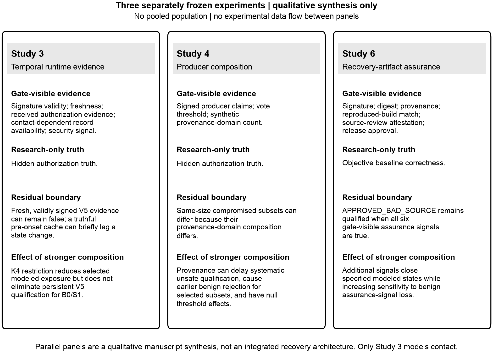

# VII. Cross-Study Residual Trust Boundaries

## A. Scope of the Synthesis

Studies 3, 4, and 6 were designed, executed, and frozen separately. Their populations, mechanisms, and endpoints are not pooled. The synthesis compares only how policy-visible evidence leaves different residual qualification boundaries; it is a manuscript-level interpretation, not a prospectively tested integrated architecture or fourth experiment.

## B. Three Qualification Layers

Fig. 1 summarizes the three layers as parallel, separately frozen experiments. The panels do not share a common measurement scale and do not represent experimental data flow or a causal sequence.

**Fig. 1.** Parallel residual trust boundaries across the three separately frozen studies. The panels summarize a qualitative manuscript-level synthesis only; no experimental data flow or integrated three-layer architecture connects Studies 3, 4, and 6. Only Study 3 models contact.

The figure preserves the same bounded comparison previously shown in Table V: Study 3 contrasts gate-visible temporal evidence with hidden authorization truth, Study 4 contrasts producer-composition rules with hidden authorization truth, and Study 6 contrasts artifact-assurance signals with objective baseline correctness. The figure is therefore a qualitative mechanism comparison, not a basis for combining numeric outcomes.

## C. Integrity Does Not Exhaust Semantic Trust

Study 3 separates post-signature alteration from false content produced inside the modeled trust boundary. `V4` invalidates the affected signature and the manipulated record does not qualify. `V5` remains validly signed by the trusted producer and can remain qualified even when hidden authorization truth is false.

Study 6 exposes an analogous upstream boundary. Additional digest, provenance, reproduced-build, review, and approval signals close specific modeled incorrect states, yet `APPROVED_BAD_SOURCE` remains qualified because every frozen gate-visible signal is true while objective correctness is false.

The implication is bounded: integrity, freshness, provenance, and process evidence establish only the properties represented by those signals and their trust anchors. They do not automatically reveal a semantic mismatch that the gate cannot observe.

## D. Stronger Composition Moves the Boundary

Study 4 shows that additional provenance structure can delay systematic unsafe qualification without always changing first failure. For example, `Q3_D3` leaves first unsafe failure at three compromised producers but moves systematic failure from three under `Q3_D1` to six. The same constraint makes benign false-conservative rejection possible after two unavailable producers rather than five. Other provenance additions produce no threshold change, so diversity is not monotonically beneficial in the frozen model.

Study 6 shows a different frontier. Stronger gates reduce the prespecified incorrect states that remain qualified from four under signature-only checking to one under the six-signal composite gate, while benign-loss subsets increase from 32/64 to 63/64. Equal counts can still hide different residual mechanisms, as `G3` and `G4` each leave two incorrect states but not the same two.

Study 3 is not folded into that availability frontier because it has different endpoints. Its contact-aware restriction reduces selected K4 exposure while persistent `V5` qualification remains present for `B0` and `S1`. Across all three studies, stronger composition changes a boundary condition rather than establishing universal dominance.

## E. Residual Identity Matters

Aggregate count or duration is insufficient to identify the remaining trust assumption. Study 4 distinguishes first from systematic failure because same-size producer subsets can differ in provenance composition. Study 6 preserves residual state identity because gates with equal unsafe counts can fail on different artifact states. Study 3 preserves false-qualification origin because a truthful pre-onset cache and a compromised-producer record represent different mechanisms.

This is why the manuscript reports origin, subset structure, and surviving artifact states rather than collapsing the studies into one scalar trust score.

## F. Observability as the Common Constraint

The common principle is observability. Study 3 cannot directly observe that a trusted signer is semantically lying; Study 4 cannot observe a compromise oracle beyond the signed claims and structural provenance labels supplied to the rule; Study 6 cannot observe objective correctness when every required assurance signal remains true.

Within each frozen model, changing the arrangement or quantity of visible evidence can narrow the set of qualifying failures, but it cannot discriminate a mismatch that remains observationally identical under the gate's variables. This is a model-specific systems result, not a universal impossibility theorem.

## G. Aerospace Systems Implications

The experiments suggest four design questions for aerospace information systems. First, recovery requirements should distinguish evidence integrity from authority and semantic trust. Second, multi-source evidence should document what operational failure separation a claimed provenance domain represents. Third, stronger evidence requirements should be assessed together with the benign conditions under which required evidence can become unavailable. Fourth, artifact assurance should identify the highest-level trust assumption that remains outside the gate.

These implications are not prescriptive flight requirements. Mission-specific adoption would require mapping the abstract producers, provenance domains, timing semantics, gates, and failure states to an actual architecture and validating that mapping under operational conditions.

## H. Synthesis Result

Taken together, the studies support a layered residual-trust interpretation of satellite cyber-recovery qualification. Temporal evidence, producer composition, and artifact assurance each close some modeled failure pathways while leaving a different residual assumption outside direct observation. The synthesis therefore does not identify a globally best policy, producer-composition rule, or artifact gate. Its contribution is to make the remaining trust assumption explicit at each layer without pooling the three experiments.
